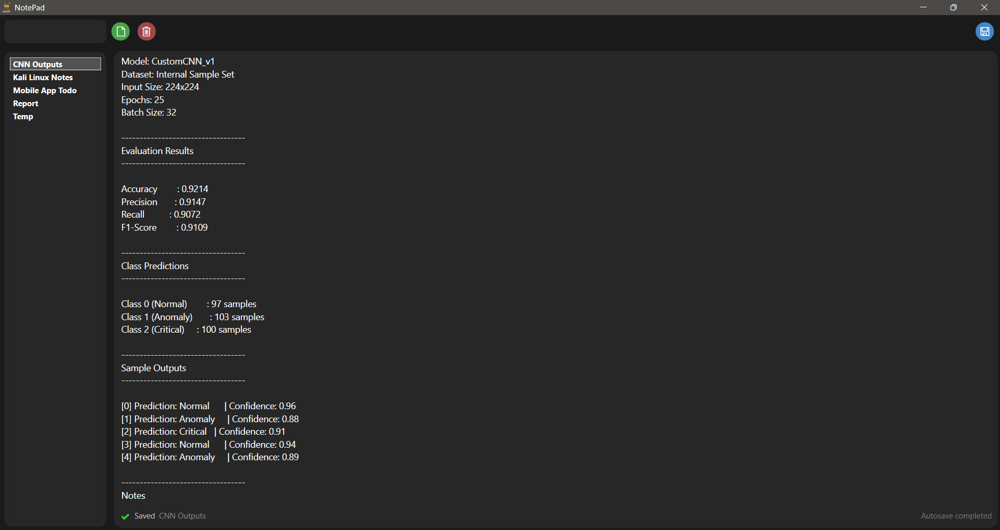

   
  <h1>Desktop Note Manager</h1>
  

    A lightweight, high-performance note-taking application designed for speed and simplicity.
     
    Developed with C# and WPF.
  

   

  
  

    

  
<strong>Table of Contents</strong>

  <ol>
    <li><a href="#about-the-project">About The Project</a></li>
    <li><a href="#technical-architecture">Technical Architecture</a></li>
    <li><a href="#key-features">Key Features</a></li>
    <li><a href="#installation">Installation</a></li>
    <li><a href="#usage">Usage</a></li>
  </ol>

<h2 id="about-the-project">About The Project</h2>

  This application originated as a proprietary tool for personal workflow management and has been
  refactored for public release. It addresses the need for a distraction-free environment to manage
  text-based data efficiently.

  Unlike complex note-taking suites that consume significant system resources, this project focuses
  on minimalism and immediacy. The user interface eliminates visual clutter, allowing users to focus
  entirely on content creation and retrieval.

<h2 id="technical-architecture">Technical Architecture</h2>

  The application is built using the Microsoft .NET ecosystem, leveraging the following technologies
  for stability, maintainability, and performance:

<ul>
  <li><strong>Language:</strong> C#</li>
  <li><strong>Framework:</strong> .NET (WPF)</li>
  <li><strong>UI Layer:</strong> XAML (Extensible Application Markup Language)</li>
  <li><strong>Architecture:</strong> Event-driven desktop application</li>
</ul>

<h2 id="key-features">Key Features</h2>

<h3>🧠 Automated Persistence (Auto-Save)</h3>

  To prevent data loss without interrupting the user workflow, the application features an
  intelligent auto-save mechanism. The system monitors user input and automatically commits changes
  to storage after <strong>2 seconds of inactivity</strong>.

<h3>⚡ High-Performance Search</h3>

  Designed to handle a large volume of text files, the application includes a dedicated search bar.
  It utilizes optimized string matching to filter documents instantly, enabling rapid retrieval of
  notes regardless of collection size.

<h3>🎯 Streamlined UI / UX</h3>
<ul>
  <li><strong>Minimalist Design:</strong> Clean layout that reduces cognitive load.</li>
  <li><strong>Fast IO Operations:</strong> Optimized read, write, and delete operations.</li>
  <li><strong>Keyboard-Friendly:</strong> Designed for speed-focused workflows.</li>
</ul>

<h2 id="installation">Installation</h2>

  This project includes a pre-compiled installer package for ease of deployment.

<ol>
  <li>Navigate to the <strong>Releases</strong> section of this repository.</li>
  <li>Download the latest <code>.msi</code> or <code>.exe</code> installer.</li>
  <li>Run the installer and follow the on-screen setup wizard.</li>
</ol>

<h2 id="usage">Usage</h2>

  Upon launching the application, users are presented with the main dashboard. Notes can be created
  instantly and are automatically persisted. Existing notes are listed in real time and can be
  filtered using the integrated search bar.

  No configuration is required — the auto-save system is enabled by default.

  <em>
    Built with a focus on performance, clarity, and developer-grade simplicity.
  </em>

